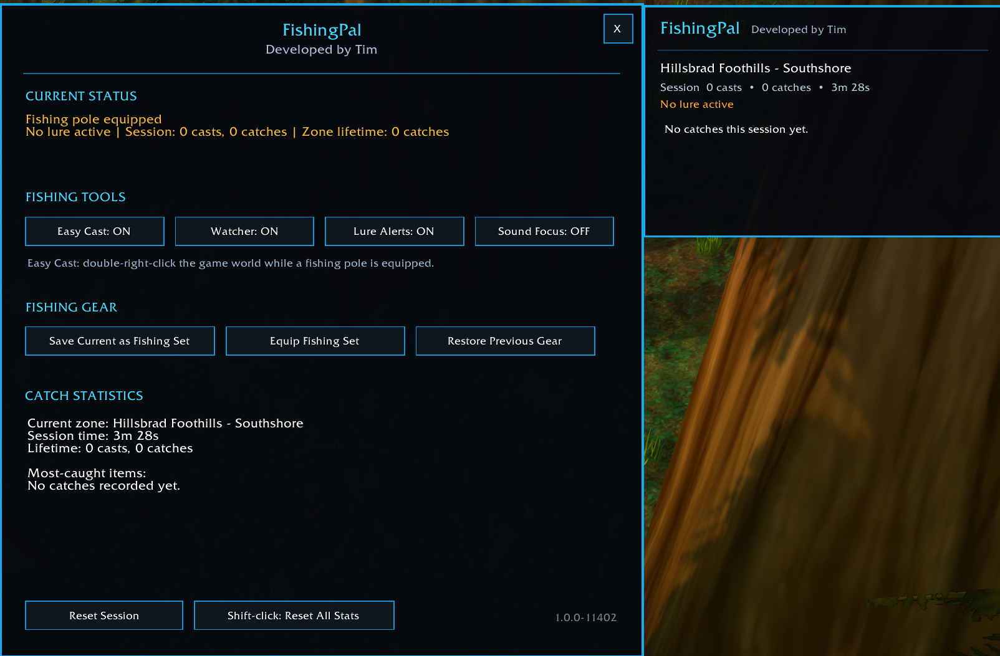

# FishingPal

**Developed by Tim**

FishingPal is an original fishing companion for World of Warcraft Classic Era 1.14.2. It combines a clean live watcher with useful fishing tools without replacing the rest of the game UI.

## In-game preview



## Features

- Double-right-click Easy Cast while a fishing pole is equipped
- Session and lifetime cast/catch statistics
- Per-zone and per-subzone catch tracking
- Live draggable catch watcher
- Reset Session button directly on the live watcher
- Fishing-lure status and missing-lure reminders
- Fishing-focused sound mode with automatic restoration
- Save, equip, and restore a fishing gear set
- Modern dark interface and compact circular minimap button
- Draggable minimap button with a position saved between logins

## Commands

```text
/fishingpal
/fpal
/fpal watch
/fpal sound
/fpal gear save
/fpal gear equip
/fpal gear restore
/fpal reset
/fpal help
```

## Installation

Extract the `FishingPal` folder into the Classic Era `Interface/AddOns` directory, enable **FishingPal - Developed by Tim**, and reload the UI.

## License

FishingPal is released under the MIT License. It is an original implementation and does not contain FishingBuddy source code or assets.
